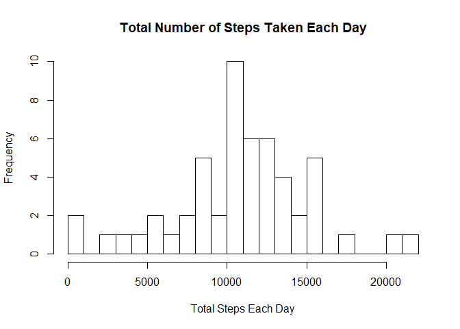
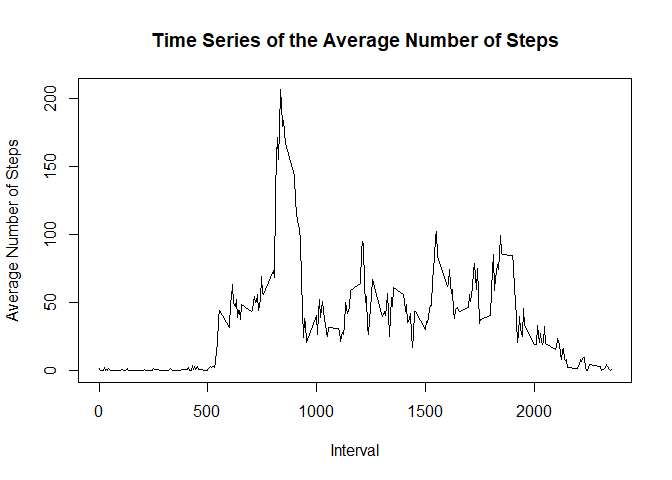
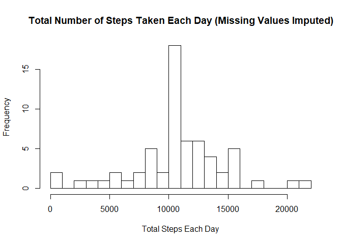
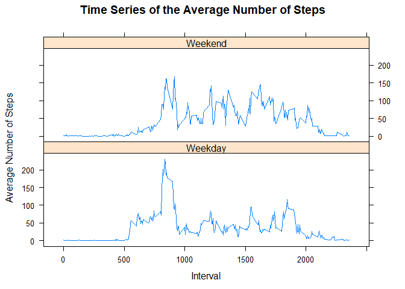

This Course Project 1 will use the Activity monitoring dataset to create the following:

- Histogram of the total number of steps taken each day
- Mean and median number of steps taken each day
- Time series plot of the average number of steps taken
- The 5-minute interval that, on average, contains the maximum number of steps
- Code to describe and show a strategy for imputing missing data
- Histogram of the total number of steps taken each day after missing values are imputed
- Panel plot comparing the average number of steps taken per 5-minute interval across weekdays and weekends


### Read in the CSV dataset and adjust it


```r
activity<-read.csv(file='activity.csv')

#create a new date variable in the Date format
activity<-mutate(activity,date2=as.Date(date))

#remove the observations where steps is na
act_rmna<-filter(activity, !is.na(steps))
```

### What is the mean total number of steps taken per day?

#### Histogram of the total number of steps taken each day


```r
#calculate the total steps by each day
by_date<-group_by(act_rmna,date2)
total_num_steps_by_date<-summarize(by_date, total_steps = sum(steps,na.rm=TRUE))

#get the histogram
hist(total_num_steps_by_date$total_steps, breaks=20,
     main="Total Number of Steps Taken Each Day",
     xlab="Total Steps Each Day")
```

<!-- -->

#### Mean and median number of the total number of steps taken each day


```r
mean(total_num_steps_by_date$total_steps)
```

```
## [1] 10766.19
```

```r
median(total_num_steps_by_date$total_steps)
```

```
## [1] 10765
```

### What is the average daily activity pattern?

#### Time series plot of the average number of steps taken


```r
#get the average number of steps by day
by_interval<-group_by(act_rmna,interval)
avg_num_steps_by_interval<-summarize(by_interval, avg_steps = mean(steps,na.rm=TRUE))

#plot the times series
plot(x=avg_num_steps_by_interval$interval, y=avg_num_steps_by_interval$avg_steps, type="l", 
     main="Time Series of the Average Number of Steps",
     xlab="Interval", ylab = "Average Number of Steps")
```

<!-- -->

#### The 5-minute interval that, on average, contains the maximum number of steps


```r
#identify which observation has the max steps
max_steps<-filter(avg_num_steps_by_interval, avg_steps == max(avg_num_steps_by_interval$avg_steps))

#print the interval with the max steps
print(max_steps$interval)
```

```
## [1] 835
```

### Imputing missing values

#### Code to describe and show a strategy for imputing missing data

My strategy for imputing missing data: get the mean number of steps for each interval and use it to replace any missing steps by interval


```r
#calculate the total number of missing values in the dataset
sum(is.na(activity$steps))
```

```
## [1] 2304
```

```r
#use the mean steps by each interval calculated above
#merge the average number of steps with the original activity dataset by interval
act_impute<-left_join(activity,avg_num_steps_by_interval,by="interval")

#insert any missing steps with the average steps for that interval
act_impute<-mutate(act_impute, steps_new = ifelse(is.na(steps),avg_steps,steps))

#drop and rename
act_impute<-select(act_impute, -steps)
act_impute<-rename(act_impute,  steps = steps_new)
```

#### Histogram of the total number of steps taken each day after missing values are imputed


```r
#calculate the total steps by each day
by_date_impute<-group_by(act_impute,date2)
total_num_steps_by_date_impute<-summarize(by_date_impute, total_steps = sum(steps,na.rm=TRUE))

#get the histogram
hist(total_num_steps_by_date_impute$total_steps, breaks=20,
     main="Total Number of Steps Taken Each Day (Missing Values Imputed)",
     xlab="Total Steps Each Day")
```

<!-- -->

#### Compare the means and median

Looking at the mean and median differences - the mean is the same but the median is slightly different. They are likely the same or close to the same because of my imputation method, where I used the mean of the intervals to fill in the missing steps. Because of this, the impact of imputing missing data is small.


```r
#old mean and median from data without imputation
mean(total_num_steps_by_date$total_steps)
```

```
## [1] 10766.19
```

```r
median(total_num_steps_by_date$total_steps)
```

```
## [1] 10765
```

```r
#new mean and median from data with imputation
mean(total_num_steps_by_date_impute$total_steps)
```

```
## [1] 10766.19
```

```r
median(total_num_steps_by_date_impute$total_steps)
```

```
## [1] 10766.19
```

### Are there differences in activity patterns between weekdays and weekends?

##### Panel plot comparing the average number of steps taken per 5-minute interval across weekdays and weekends


```r
#identify which day of the week the date is and create a factor
act_impute2<-mutate(act_impute, day_of_week=weekdays(date2))
act_impute3<-mutate(act_impute2, daytypef=as.factor(ifelse(day_of_week == "Saturday" | day_of_week == "Sunday", "Weekend", "Weekday")))
#act_impute2<-mutate(act_impute2, daytypef=as.factor(daytype))

#get the average number of steps by interval
by_interval_daytype<-group_by(act_impute3,interval,daytypef)
avg_num_steps_by_interval_daytype<-summarize(by_interval_daytype, avg_steps = mean(steps,na.rm=TRUE))

#plot the times series
xyplot(avg_num_steps_by_interval_daytype$avg_steps ~ avg_num_steps_by_interval_daytype$interval | avg_num_steps_by_interval_daytype$daytypef, 
       type="l", layout=c(1,2),
       xlab="Interval", ylab="Average Number of Steps",
       main="Time Series of the Average Number of Steps")
```

<!-- -->


